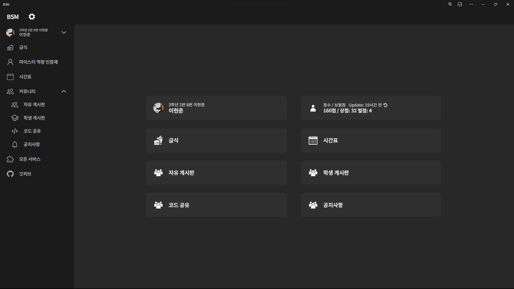
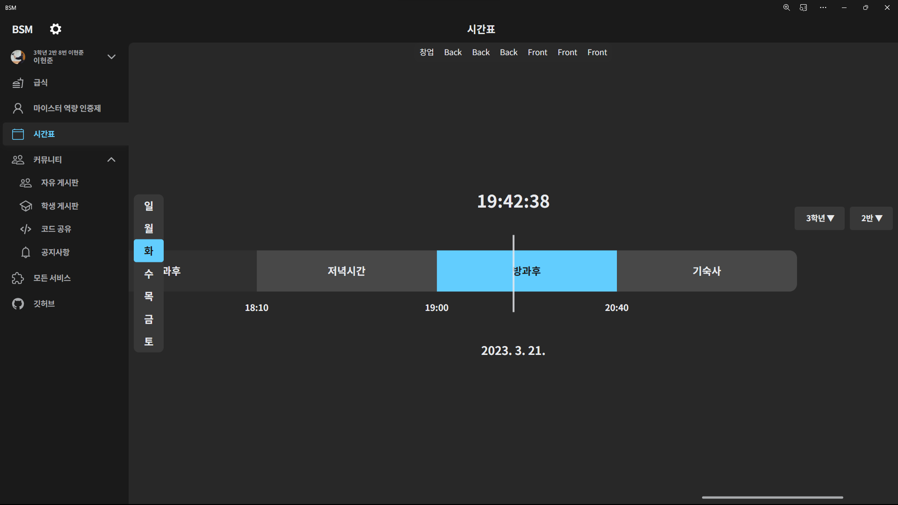
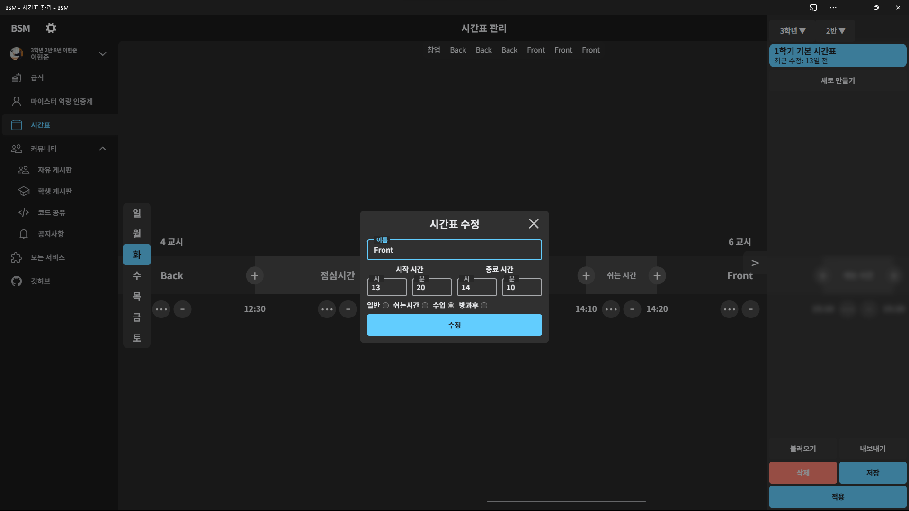
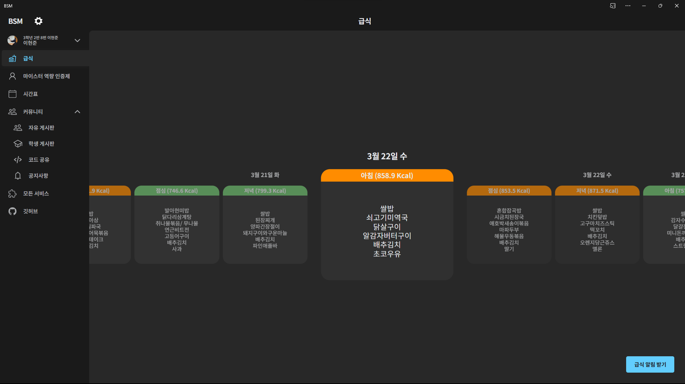
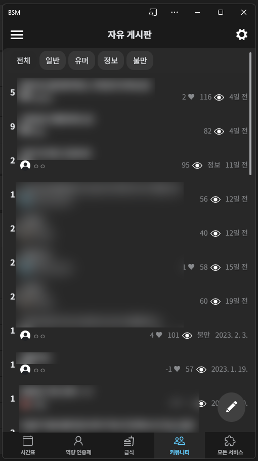

# BSM Backend V2

해당 프로젝트의 프론트엔드는 [BSM-Frontend-V2](https://github.com/BSSM-BSM/BSM-Frontend-V2)를 확인해주세요.

## 프로젝트 소개
BSM(부산소마고 지원 서비스)는 학교 홈페이지, 마이스터 인증제 사이트 등 그동안 여러 곳에 흩어져있던 학교 생활에 도움이되는 기능들을 하나의 플랫폼에서 제공하기 위해 만들어진 학교 통합 지원서비스입니다.

서버는 [저(이현준)](https://github.com/leehj050211)의 집에서 라즈베리파이를 이용하여 직접 호스팅하고 있습니다.

구글 애널리틱스 기준으로 하루 평균 90명 정도가 이 서비스를 사용하며  
가입자수는 2022년 10월 24일 기준으로 111명이 가입 중입니다.

## 기능 소개

- 급식 정보 보기 및 급식 1시간 전에 오는 푸시 알림
- 마이스터 역량인증제 점수 및 상벌점 랭킹과 간편하게 보기 
- 현재 진행중인 수업이 하이라이팅되어 표시되는 시간표
- 자체적인 커뮤니티
    - 대댓글
    - 익명 작성 기능
    - 좋아요, 싫어요
    - 게시글 카테고리
    - 이모티콘
- BSM OAuth를 통한 간편 로그인

## 결과 화면

